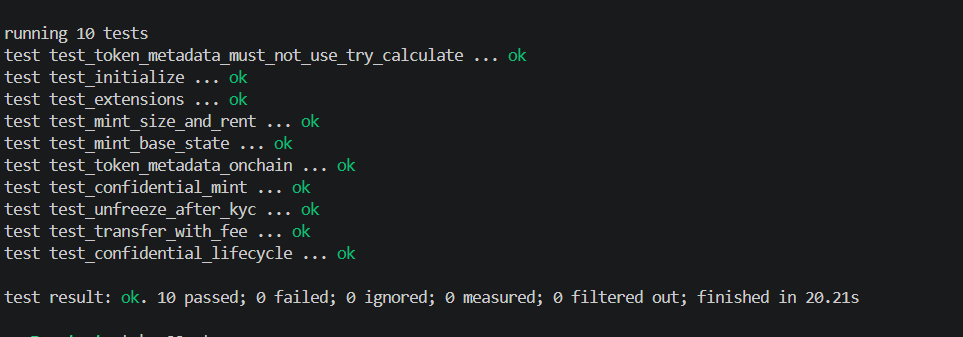

# Solana Token-2022 Remittance Stablecoin & Confidential Transfers

An enterprise-grade remittance stablecoin (`RUSD`) implementation on Solana using the SPL Token-2022 (Token Extensions) standard, featuring protocol-level transfer fees, mandatory default account freezing for KYC compliance, on-chain metadata, permanent delegate seizure authority, and Zero-Knowledge (ZK) Confidential Transfers.

---

## Overview

The program implements a compliant stablecoin designed for cross-border remittances:

1. **Protocol-Level Transfer Fees**: Deducts an issuer fee on every transfer calculated dynamically at the current epoch.
2. **KYC Gate via Default Account State**: New token accounts are created in a `Frozen` state by default, requiring the issuer's freeze authority to unfreeze individual accounts after KYC clearance.
3. **On-Chain Token Metadata**: Embeds metadata directly within the mint account using the `MetadataPointer` and `TokenMetadata` extensions without relying on external off-chain programs.
4. **Permanent Delegate for Regulatory Compliance**: Configures a seizure authority capable of moving plaintext balances from non-compliant accounts.
5. **Confidential Transfers (ZK ElGamal Encryption)**: Enables users to deposit funds into encrypted confidential balances, execute peer-to-peer confidential transfers with encrypted fee withholding, and withdraw back to public balances.

---

## Program Details

- **Program ID**: `7MhqudaCvXdPr5LKvvEuZt5UJ9k1g1kStkoXt3CxDEXM`
- **Framework**: Anchor 0.30.1 / Rust
- **Token Program**: SPL Token-2022 (`spl-token-2022`)
- **Metadata Standard**: SPL Token Metadata Interface (`spl-token-metadata-interface`)
- **Cryptography**: ZK Proofs & ElGamal Encryption (`solana-zk-token-sdk`)

---

## Token Specifications & Extension Stack

### 1. Configuration Parameters

| Parameter | Value | Description |
| :--- | :--- | :--- |
| `Token Name` | `Remittance USD` | On-chain token name |
| `Token Symbol` | `RUSD` | On-chain token symbol |
| `Decimals` | `6` | Base decimal precision |
| `Transfer Fee` | `100 bps` (1.00%) | Protocol fee deducted per transfer |
| `Maximum Fee` | `u64::MAX` | Maximum fee cap |
| `Metadata URI` | `https://example.com/rusd.json` | Token metadata URI |

### 2. Standard Mint Extension Stack

The standard remittance mint stacks the following extensions:

- `TransferFeeConfig`: Calculates and withholds transfer fees.
- `MintCloseAuthority`: Permits designated authority to close the mint and reclaim rent.
- `DefaultAccountState`: Enforces `AccountState::Frozen` for all newly initialized token accounts.
- `MetadataPointer`: Points metadata resolution directly to the mint address.
- `TokenMetadata`: Variable-length TLV extension embedding token name, symbol, and URI.

### 3. Confidential Mint Extension Stack

The confidential remittance mint expands the extension set to include regulatory and privacy capabilities:

- `PermanentDelegate`: Permits issuer to execute administrative transfers/seizures on plaintext balances.
- `ConfidentialTransferMint`: Configures ZK confidential transfer parameters (`auto_approve_new_accounts = false`).
- `ConfidentialTransferFeeConfig`: Enables encrypted fee withholding using the fee authority's ElGamal public key.

---

## Technical Architecture & Account Sizing

### Exact Account Allocation

Token-2022 requires account space to be allocated exactly matching the initialized fixed extensions prior to calling `InitializeMint2`. Variable-length extensions (`TokenMetadata`) grow the account dynamically:

1. **Fixed Extension Allocation**:
   ```rust
   let space = ExtensionType::try_calculate_account_len::<MintState>(fixed_extensions)?;
   ```
2. **Rent Exemption Calculation**:
   ```rust
   let lamports = Rent::get()?.minimum_balance(space + TLV_HEADER_LEN + metadata.get_packed_len()?);
   ```
3. **CPI Execution Order**:
   - `create_account` with calculated `space` and `lamports`
   - Extension initialization CPIs (`transfer_fee`, `mint_close`, `default_state`, `metadata_pointer`, `permanent_delegate`, `confidential_transfer`)
   - `initialize_mint2`
   - `token_metadata_initialize`

### State Deserialization

All mint and token account inspection uses `StateWithExtensions` to safely unpack extension data:
```rust
let mint = StateWithExtensions::<MintState>::unpack(&data)?;
let fee = mint.get_extension::<TransferFeeConfig>()?.calculate_epoch_fee(epoch, amount);
```

---

## Instructions

### 1. `initialize`

Initializes the base remittance mint with `TransferFeeConfig`, `MintCloseAuthority`, `DefaultAccountState` (Frozen), `MetadataPointer`, and `TokenMetadata`.

- **Signer**: Payer (Mint Authority / Update Authority)

### 2. `transfer_with_fee`

Executes a fee-deducting transfer via `transfer_checked_with_fee`. The expected fee is computed dynamically using the current clock epoch rather than a cached rate.

- **Parameters**: `amount: u64`, `decimals: u8`
- **Signer**: Source Token Authority

### 3. `unfreeze_kyc_account`

Thaws an individual frozen token account after KYC verification without altering the global mint default state.

- **Signer**: Freeze Authority

### 4. `initialize_confidential_mint`

Re-issues the mint with the complete extension stack: `TransferFeeConfig`, `MintCloseAuthority`, `DefaultAccountState`, `MetadataPointer`, `PermanentDelegate`, `ConfidentialTransferMint`, and `ConfidentialTransferFeeConfig`.

- **Parameters**: `withdraw_withheld_authority_elgamal_pubkey: [u8; 32]`
- **Signer**: Payer

### 5. `deposit_confidential`

Deposits public plaintext tokens into the user's encrypted pending confidential balance.

- **Parameters**: `amount: u64`, `decimals: u8`
- **Signer**: Token Account Owner

### 6. `apply_pending_balance`

Applies the pending encrypted balance to the user's available confidential balance, making it spendable for confidential transfers and withdrawals.

- **Parameters**: `expected_pending_balance_credit_counter: u64`, `new_decryptable_available_balance: [u8; 36]`
- **Signer**: Token Account Owner

---

## Confidential Token Lifecycle

```text
[ Public Plaintext Balance ]
             │
             │ deposit_confidential
             ▼
[ Encrypted Pending Balance ]
             │
             │ apply_pending_balance
             ▼
[ Encrypted Available Balance ] ──(confidential_transfer)──► [ Recipient Pending Balance ]
             │
             │ withdraw_confidential
             ▼
[ Public Plaintext Balance ]
```

---

## Security & Regulatory Analysis

### Permanent Delegate vs. Confidential Transfers

When both `PermanentDelegate` (seizure authority) and `ConfidentialTransferMint` are enabled on the same mint:

- **Plaintext Scope**: The `PermanentDelegate` can seize, transfer, or burn only **plaintext public balances**.
- **Confidential Boundary**: Once tokens are deposited into the confidential system and applied to the available balance, they are shielded behind ElGamal ciphertexts. Moving confidential balances requires Zero-Knowledge proofs signed by the account owner's private ElGamal key.
- **Seizure Race Condition**: The permanent delegate cannot forge ZK proofs to seize confidential funds. To enforce regulatory action against a sanctioned address, the authority must freeze the account before the user moves public funds into the confidential extension. Auditor keys allow authorized viewing of confidential balances, but do not provide seizure capabilities.

---

## Project Structure

```text
token22-ct/
├── Anchor.toml
├── Cargo.toml
├── programs/
│   └── token22-ct/
│       ├── Cargo.toml
│       ├── src/
│       │   ├── lib.rs                      # Program entrypoint & instruction dispatch
│       │   ├── constants.rs                # Token constants & parameters
│       │   ├── instructions.rs
│       │   └── instructions/
│       │       ├── initialize.rs           # Standard mint initialization
│       │       ├── transfer.rs             # TransferCheckedWithFee handler
│       │       ├── unfreeze.rs             # KYC thaw account instruction
│       │       ├── confidential_mint.rs    # Confidential mint initialization
│       │       ├── deposit.rs              # Confidential token deposit
│       │       └── apply.rs                # Apply pending confidential balance
│       └── tests/
│           ├── test_all.rs                 # Comprehensive test suite
│           └── test_handler/
│               ├── initialize.rs
│               ├── transfer_fee.rs
│               ├── unfreeze.rs
│               ├── confidential_mint.rs
│               └── confidential.rs
└── proof/
    └── image.png                           # LiteSVM test verification output
```

---

## Building and Testing

### Prerequisites

- Rust `1.75.0+`
- Solana CLI `1.18+`
- Anchor CLI `0.30.1`

### Build

```bash
anchor build
```

### Test

The project includes an in-depth `litesvm` test suite validating mint initialization, extension ordering, fee deductions, KYC unfreezing, and full confidential lifecycle flows:

```bash
cargo test --package token22-ct
```

### Test Coverage

- `test_initialize`: Validates base mint creation and account persistence.
- `test_mint_base_state`: Verifies decimals, initial supply, mint authority, and freeze authority.
- `test_extensions`: Checks configuration parameters for all standard extensions.
- `test_token_metadata_onchain`: Verifies embedded name, symbol, URI, and update authority.
- `test_mint_size_and_rent`: Verifies byte-exact allocation and rent exemption.
- `test_token_metadata_must_not_use_try_calculate`: Validates error handling for variable-length extensions.
- `test_transfer_with_fee`: Verifies 100 bps transfer fee deduction and recipient credit.
- `test_unfreeze_after_kyc`: Asserts KYC thaw path unlocks individual accounts while keeping default state frozen.
- `test_confidential_mint`: Checks initialization of confidential mint with 7 fixed extensions and on-chain metadata.
- `test_confidential_lifecycle`: Validates complete end-to-end workflow (deposit -> apply -> confidential transfer with fee -> apply -> withdraw).

---

## Execution & Test Proof

All integration tests executed successfully against the compiled Token-2022 program binary using LiteSVM:

